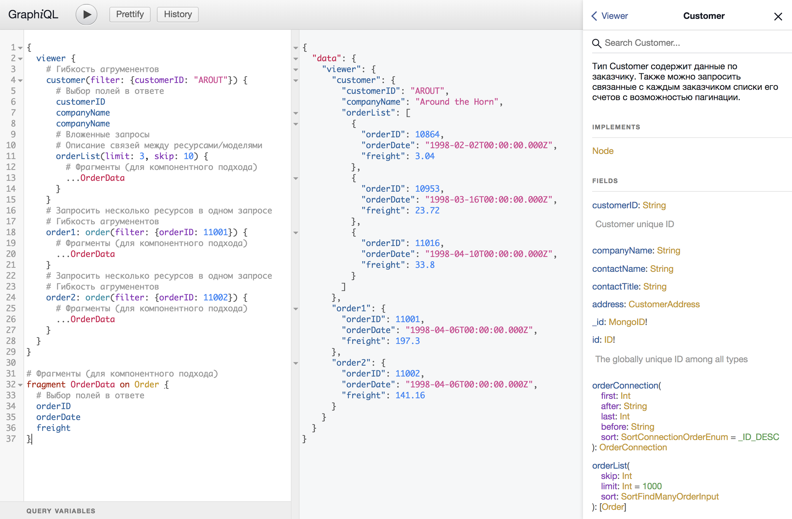

# Swagger — прошлый век

Сейчас модно обернуть REST API свагерром и говорить, что у нас супер-пупер апи, с типизацией, документацией, хорошей тулзой для просмотра endpoint'ов и выполнения тестовых запросов.

## У бэкендера хорошая отмазка, что он все сделал по высшему разряду

Конечно открывая Swagger Inspector, появляется красивый модный и молодежный интерфейс. Просто плюшевая радость для бэкендера. Такой штукой можно козырять на планерках и говорить, что мы (бэкендеры) все сделали на высшем уровне, и у фронтендеров есть вся информация об АПИ под рукой. Продак-менеджеры смотря на это, одобряюще кивают головой, и хвалят за красивую неведому-зверюшку. Хотя пользоваться этим инструментом фронтендерам ой как не просто. Но слава богу, хотябы это есть, а не какая-то самопальная вечно-устаревшая документация.

[Живое демо на Youtube](https://www.youtube.com/watch?v=BeclZb68m_s)

## У фронтендера вечная боль и печаль

Продвинутые бедняжки фронтендеры, берут сваггер схему и че-нить себе генерируют.
Вот есть видео о кодогенерации тайпингов тайпскрипта и клиентов к апи для Ангуляра из сваггер схемы:
<https://www.youtube.com/watch?v=poGSTQ2XGY0> (ссылки на сваггер из видео <https://adjwt-api.rabota.ua/swagger/> <https://admin-api.rabota.ua/swagger/> <https://api.rabota.ua/swagger/>)

Почему "забавное", да потому что генерит кучу кода, а потом сиди в нем ковыряйся. От того, что нагенерилось легче не стало понимать связи между ресурсами, которые там себе понастроили бэкендеры. Как тока придется строить интерфейс из нескольких зависимых между собой ресурсов, пора идти к бекендерам:

- либо узнавать, а точно ли для задачи надо использовать ресурсАА, а не ресурсАБ, а то они очень похожи, а может есть готовый подресурс, а может сделаем?!
- либо просить дополнительную фильтрацию
- либо просить новый агрегированный ендпоинт, чтоб сократить количество запросов и общий объем всех ответов

## Минусы сваггера

- Как вообще этой "фигней" пользоваться, чтоб собрать формочку для сохранения данных? Наверное надо идти к бекендерам за консультацией.
- Каждый ендпоинт описывается примитивными типами, нет "сложных" типов
- Нет связей между типами, не известно как оптимальнее всего запросить связанные ресурсы
- Жирные ответы, если не прикрутить фильтрт по полям. Но даже если есть фильтр по полям, то ленивых фронтендеров, которые ими не пользуются - никто не отменял.
- Нет возможности построить сложный агрегационный запрос без участия бэкендера
- Из-за REST API нет возможности использовать Apollo Client или Relay, приходиться использовать Redux, MobX

**Самый жирный минус:**

- Фронтендеры пишут кучу бойлерплейт кода, для получения связанных данных между ресурсами. Часто гадают на кофейной гуще. Часто с матами. Лучше и правильнее чем бэкендер, который проектировал модели и базу, никто такие связи на клиенте не построит.

## Что же делать?

Отправлять Swagger на пенсию и брать на его место GraphQL.

Я не люблю таблички сравнения, т.к. они часто притянуты за уши автором. Но для закрепления материала, воспользуюсь этим "грязным" хаком:

| Фича | Swagger | GraphQL |
| --- | --- | --- |
| Описание связей между ресурсами/моделями | нет, но можно расписать в документации | есть, можно задать связь с фильтрацией |
| Выбор полей в ответе | надо шаманить | из коробки |
| Гибкость агруменентов | слабенькая | есть, на любом уровне вложенности запроса |
| Вложенные запросы | надо подождать пока бекендер создаст новый агрегированный ендпоинт | любые по воле фронтендера, если связи между типами расписаны |
| Запросить несколько ресурсов в одном запросе | нет | есть, из коробки |
| Фрагменты (для компонентного подхода) | нет | разрабатывался для этого |
| Утилита для написания и тестирования запросов | Swagger Inspector | GraphiQL, GraphQL Playground, eslint plugin |
| Документация | есть | есть |
| Описание типов | примитивное | поддерживает сложные типы |
| Frontend developer friendly | so-so | разрабатывался для фронтедеров |
| Экзотика полиморфизма | без описания | есть Interfaces, Union types |
| Протокол передачи данных | привязка к `HTTP Method` и `Status code` | нет привязки к HTTP протоколу, поэтому Method неважен, а `Status code` либо `500` - сервер помер, либо `200` - сервер отработал, даже если произошла ошибка. Можно использовать с WebSockets, или всякой экзотикой типа SSH, telnet, SMTP и т.п.|

## GraphQL — смотрим и щупаем

Давайте оценим GraphQL, посмотрев на скриншот сделаный в утилите `GraphiQL`:

- в первой колонке мы видим вложенный запрос с кучей аргументов и нескольких ресурсов
- во второй колонке мы получаем ответ от сервера, в котором предоставлены данные по одному заказчику с его тремя заказами и двумя совершенно сторонними заказами
- в третьей колонке предоставлено описание типа `Customer` - документацией, описанием полей и интерфейсом `Node` который он реализует.

Картинка кликабельна, по ней Live Demo.

[](https://graphql-compose.herokuapp.com/northwind/?query=%7B%0A%20%20viewer%20%7B%0A%20%20%20%20%23%20%D0%93%D0%B8%D0%B1%D0%BA%D0%BE%D1%81%D1%82%D1%8C%20%D0%B0%D0%B3%D1%80%D1%83%D0%BC%D0%B5%D0%BD%D0%B5%D0%BD%D1%82%D0%BE%D0%B2%0A%20%20%20%20customer%28filter%3A%20%7BcustomerID%3A%20%22AROUT%22%7D%29%20%7B%0A%20%20%20%20%20%20%23%20%D0%92%D1%8B%D0%B1%D0%BE%D1%80%20%D0%BF%D0%BE%D0%BB%D0%B5%D0%B9%20%D0%B2%20%D0%BE%D1%82%D0%B2%D0%B5%D1%82%D0%B5%0A%20%20%20%20%20%20customerID%0A%20%20%20%20%20%20companyName%0A%20%20%20%20%20%20companyName%0A%20%20%20%20%20%20%23%20%D0%92%D0%BB%D0%BE%D0%B6%D0%B5%D0%BD%D0%BD%D1%8B%D0%B5%20%D0%B7%D0%B0%D0%BF%D1%80%D0%BE%D1%81%D1%8B%0A%20%20%20%20%20%20%23%20%D0%9E%D0%BF%D0%B8%D1%81%D0%B0%D0%BD%D0%B8%D0%B5%20%D1%81%D0%B2%D1%8F%D0%B7%D0%B5%D0%B9%20%D0%BC%D0%B5%D0%B6%D0%B4%D1%83%20%D1%80%D0%B5%D1%81%D1%83%D1%80%D1%81%D0%B0%D0%BC%D0%B8%2F%D0%BC%D0%BE%D0%B4%D0%B5%D0%BB%D1%8F%D0%BC%D0%B8%0A%20%20%20%20%20%20orderList%28limit%3A%203%2C%20skip%3A%2010%29%20%7B%0A%20%20%20%20%20%20%20%20%23%20%D0%A4%D1%80%D0%B0%D0%B3%D0%BC%D0%B5%D0%BD%D1%82%D1%8B%20%28%D0%B4%D0%BB%D1%8F%20%D0%BA%D0%BE%D0%BC%D0%BF%D0%BE%D0%BD%D0%B5%D0%BD%D1%82%D0%BD%D0%BE%D0%B3%D0%BE%20%D0%BF%D0%BE%D0%B4%D1%85%D0%BE%D0%B4%D0%B0%29%0A%20%20%20%20%20%20%20%20...OrderData%0A%20%20%20%20%20%20%7D%0A%20%20%20%20%7D%0A%20%20%20%20%23%20%D0%97%D0%B0%D0%BF%D1%80%D0%BE%D1%81%D0%B8%D1%82%D1%8C%20%D0%BD%D0%B5%D1%81%D0%BA%D0%BE%D0%BB%D1%8C%D0%BA%D0%BE%20%D1%80%D0%B5%D1%81%D1%83%D1%80%D1%81%D0%BE%D0%B2%20%D0%B2%20%D0%BE%D0%B4%D0%BD%D0%BE%D0%BC%20%D0%B7%D0%B0%D0%BF%D1%80%D0%BE%D1%81%D0%B5%0A%20%20%20%20%23%20%D0%93%D0%B8%D0%B1%D0%BA%D0%BE%D1%81%D1%82%D1%8C%20%D0%B0%D0%B3%D1%80%D1%83%D0%BC%D0%B5%D0%BD%D0%B5%D0%BD%D1%82%D0%BE%D0%B2%0A%20%20%20%20order1%3A%20order%28filter%3A%20%7BorderID%3A%2011001%7D%29%20%7B%0A%20%20%20%20%20%20%23%20%D0%A4%D1%80%D0%B0%D0%B3%D0%BC%D0%B5%D0%BD%D1%82%D1%8B%20%28%D0%B4%D0%BB%D1%8F%20%D0%BA%D0%BE%D0%BC%D0%BF%D0%BE%D0%BD%D0%B5%D0%BD%D1%82%D0%BD%D0%BE%D0%B3%D0%BE%20%D0%BF%D0%BE%D0%B4%D1%85%D0%BE%D0%B4%D0%B0%29%0A%20%20%20%20%20%20...OrderData%0A%20%20%20%20%7D%0A%20%20%20%20%23%20%D0%97%D0%B0%D0%BF%D1%80%D0%BE%D1%81%D0%B8%D1%82%D1%8C%20%D0%BD%D0%B5%D1%81%D0%BA%D0%BE%D0%BB%D1%8C%D0%BA%D0%BE%20%D1%80%D0%B5%D1%81%D1%83%D1%80%D1%81%D0%BE%D0%B2%20%D0%B2%20%D0%BE%D0%B4%D0%BD%D0%BE%D0%BC%20%D0%B7%D0%B0%D0%BF%D1%80%D0%BE%D1%81%D0%B5%0A%20%20%20%20%23%20%D0%93%D0%B8%D0%B1%D0%BA%D0%BE%D1%81%D1%82%D1%8C%20%D0%B0%D0%B3%D1%80%D1%83%D0%BC%D0%B5%D0%BD%D0%B5%D0%BD%D1%82%D0%BE%D0%B2%0A%20%20%20%20order2%3A%20order%28filter%3A%20%7BorderID%3A%2011002%7D%29%20%7B%0A%20%20%20%20%20%20%23%20%D0%A4%D1%80%D0%B0%D0%B3%D0%BC%D0%B5%D0%BD%D1%82%D1%8B%20%28%D0%B4%D0%BB%D1%8F%20%D0%BA%D0%BE%D0%BC%D0%BF%D0%BE%D0%BD%D0%B5%D0%BD%D1%82%D0%BD%D0%BE%D0%B3%D0%BE%20%D0%BF%D0%BE%D0%B4%D1%85%D0%BE%D0%B4%D0%B0%29%0A%20%20%20%20%20%20...OrderData%0A%20%20%20%20%7D%0A%20%20%7D%0A%7D%0A%0A%23%20%D0%A4%D1%80%D0%B0%D0%B3%D0%BC%D0%B5%D0%BD%D1%82%D1%8B%20%28%D0%B4%D0%BB%D1%8F%20%D0%BA%D0%BE%D0%BC%D0%BF%D0%BE%D0%BD%D0%B5%D0%BD%D1%82%D0%BD%D0%BE%D0%B3%D0%BE%20%D0%BF%D0%BE%D0%B4%D1%85%D0%BE%D0%B4%D0%B0%29%0Afragment%20OrderData%20on%20Order%20%7B%0A%20%20%23%20%D0%92%D1%8B%D0%B1%D0%BE%D1%80%20%D0%BF%D0%BE%D0%BB%D0%B5%D0%B9%20%D0%B2%20%D0%BE%D1%82%D0%B2%D0%B5%D1%82%D0%B5%0A%20%20orderID%0A%20%20orderDate%0A%20%20freight%0A%7D)

Больше примеров GraphQL схем вы можете посмотреть по ссылке [https://graphql-compose.herokuapp.com/](https://graphql-compose.herokuapp.com/). Оцените автоподставку полей, валидацию запросов, документацию (клик в верхнем правом углу по `Docs`). Сможете оценить альтернативную утилиту `GraphQL Playground`. А также поковырять реально большую и сложную GraphQL схему, где более 10000 типов - полное API `Amazon Web Services` со 125 сервисами и 3857 операциями (схема весит порядка 10 Mb, вам придеться подождать пол минуты пока она загрузится с медленного бесплатного хостинга Heroku).

## На закуску

Статьи других авторов, которые сравнивают GraphQL с REST:

- [Сравнение REST и GraphQL](https://habr.com/post/335158/), перевод от @bevalorous самой популярной статьи Sashko Stubailo
- [GraphQL — новый взгляд на API. Ч.1](https://habr.com/post/343872/) от @VladimirZaets
